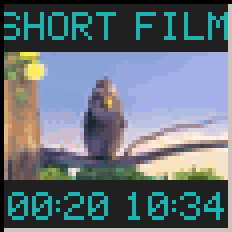

# wmtube

[](https://github.com/michaelsternberg/wmtube/actions/workflows/build.yml)

A YouTube / PeerTube player dockapp for [Window Maker](https://www.windowmaker.org/).



wmtube streams a video into a 64x64 dock tile. It plays YouTube, PeerTube (any
server), or anything else [yt-dlp](https://github.com/yt-dlp/yt-dlp) can
resolve. The 16:9 video fills a 56x32 band in the middle of the tile. The rows
above and below can show a scrolling title and the elapsed / total play time,
in the 5x7 sea-green LED style of wmtop and other classic dockapps.

```
+----------------+
|  SCROLLING TI  |   title marquee
|################|
|#### VIDEO #####|   56x32 video
|################|
| 01:23    10:34 |   elapsed / total (scrolls for videos >= 1 hour)
+----------------+
```

## Requirements

- libmpv, libX11, libXext and their development headers
  - Debian / Ubuntu: `sudo apt install libmpv-dev libx11-dev libxext-dev pkg-config`
- A current [yt-dlp](https://github.com/yt-dlp/yt-dlp), installed with pipx
  (`pipx install yt-dlp`). Distribution packages, including Debian's, fall
  behind too quickly to keep working with YouTube. wmtube puts `~/.local/bin`
  first in its `$PATH` at startup, so the pipx copy is found even if the
  window manager's `$PATH` lacks it.
- `mpv` (optional), for the double-click "open full size" action

## Installing

On Debian 13 (trixie) and derivatives, download the `.deb` from the
[latest release](https://github.com/michaelsternberg/wmtube/releases/latest)
and install it with apt, which also pulls in the libraries it needs:

```sh
sudo apt install ./wmtube_*_amd64.deb
```

Use `apt install`, not `dpkg -i`. dpkg installs only the file itself, so
libmpv and the other libraries are left missing and the package stays
unconfigured. If you already used dpkg, `sudo apt -f install` fixes it. The
`./` matters, because without a slash apt looks for a package of that name in
its repositories.

Then install a current yt-dlp with pipx. wmtube can't play YouTube without it:

```sh
sudo apt install pipx
pipx install yt-dlp
```

The package recommends `mpv`, so apt installs it by default. It is used for
the double-click "open full size" action. Debian's `yt-dlp` is only
suggested, because it is usually too old to work. If it is installed anyway it
does no harm: wmtube runs the pipx copy in `~/.local/bin` first. Keep the pipx
copy current with `pipx upgrade yt-dlp` whenever videos stop loading.

## Building

```sh
make
sudo make install        # PREFIX=/usr/local by default; DESTDIR is honoured
```

To build the Debian package yourself (needs `debhelper`):

```sh
dpkg-buildpackage -us -uc -b      # writes ../wmtube_<version>_amd64.deb
```

## Usage

```
wmtube [options] [URL]

  -mode both|title|time|none   text rows shown at start (default both)
  -fg COLOR / -bg COLOR        text / background colour
  -mute, -loop
  -tracknum                    show playlist position as TITLE [M/N]
  -ytdl-format FMT             yt-dlp format (default: 144p, H.264 preferred)
  -display DISPLAY             X display to use
```

Drag the tile into the dock or clip. With nothing playing the tile just shows
`WMTUBE`; left-click it to show (or hide) a scrolling summary of the mouse
controls. Middle-click the tile to play the URL in the selection or
clipboard. For safety, the selection only accepts `http(s)://` URLs, or a
bare `youtube.com` / `youtu.be` address, so PeerTube links need their full
`https://` URL. Local files can still be given on the command line.

Playlist links (including YouTube Music playlists) play their tracks in
order. Between tracks the video area goes blank and the title shows
`LOADING` until the next one starts; album-only tracks show their cover art.

Internet radio and other live streams (e.g. Icecast / SHOUTcast URLs) play
with a blank video area and elapsed time only; the title follows the
station's "now playing" information as songs change.

## Mouse

| Action          | Effect                                                                 |
|-----------------|------------------------------------------------------------------------|
| Left            | pause / resume; with no video loaded, show / hide the scrolling help   |
| Double left     | open full size in `mpv` at the current position                        |
| Right           | cycle text rows: both → title → time → none                            |
| Shift + left    | seek back 10 s                                                         |
| Shift + right   | seek forward 10 s                                                      |
| Ctrl + left     | previous track (playlists)                                             |
| Ctrl + right    | next track (playlists)                                                 |
| Ctrl+Shift+left | stop, clear the playlist and reset to the startup state                |
| Middle          | play URL from PRIMARY / CLIPBOARD                                      |
| Wheel           | volume                                                                 |

## How it works

libmpv runs with `vo=libmpv` and the software render API. mpv scales each
frame straight into a 56x32 buffer. wmtube combines that buffer with the bevel
and text into a 64x64 framebuffer and pushes it to the dockapp's icon window.
Everything runs in one `poll()` loop on the X connection and an mpv wakeup
pipe. By default it requests a 144p stream, which uses a few percent of one
CPU core.

## Troubleshooting

### NO YT-DLP FOUND

The tile shows this at startup when neither `yt-dlp` nor `youtube-dl` is in
`$PATH` or `~/.local/bin`. Install a current yt-dlp with `pipx install yt-dlp`
and restart wmtube.

### "The page needs to be reloaded" or "Failed to recognize file format"

```
wmtube: [ytdl_hook] ERROR: [youtube] AMHDlEV2Gxw: The page needs to be reloaded.
wmtube: [ytdl_hook] youtube-dl failed: unexpected error occurred
wmtube: [cplayer] Failed to recognize file format.
```

This almost always means mpv is running an outdated yt-dlp. YouTube changes
often, and an old yt-dlp can no longer resolve its videos. wmtube itself is
fine. For errors like this the tile adds `- TRY PIPX UPGRADE YT-DLP` to the
scrolling error message. Errors that come from the site, such as "This video
is unavailable", are shown without it.

A common cause is having two copies of yt-dlp: the Debian package in
`/usr/bin/yt-dlp`, which falls behind quickly, and a current one somewhere
else. wmtube puts `~/.local/bin` (pipx's default) first in its `$PATH`, so a
pipx copy there wins. A newer copy anywhere else must come before `/usr/bin`
in the `$PATH` the window manager hands to wmtube.

To check, list every copy and its version:

```sh
which -a yt-dlp
yt-dlp --version
```

To fix it, install a current yt-dlp with pipx and restart wmtube:
`pipx install yt-dlp`. You may also remove the outdated Debian package with
`sudo apt remove yt-dlp`.

After that, keep yt-dlp current with `pipx upgrade yt-dlp` whenever videos
stop loading.

## Disclaimer

wmtube is an independent project. It is not affiliated with, endorsed by, or sponsored by YouTube, Google LLC, or the PeerTube project / Framasoft. YouTube is a trademark of Google LLC; PeerTube is a trademark of Framasoft. Users are responsible for complying with the terms of service of the sites they play videos from.

## License

GPL version 2 or later; see [COPYING](COPYING).

The animation shows *Big Buck Bunny*, © Blender Foundation,
[CC BY 3.0](https://creativecommons.org/licenses/by/3.0/).
