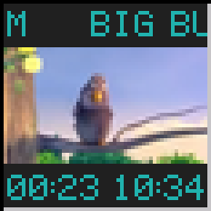

# wmtube

[](https://github.com/michaelsternberg/wmtube/actions/workflows/build.yml)

A YouTube / PeerTube player dockapp for [Window Maker](https://www.windowmaker.org/).



wmtube streams a video into a 64x64 dock tile. It plays YouTube, PeerTube (any
server), or anything else [yt-dlp](https://github.com/yt-dlp/yt-dlp) can
resolve. The 16:9 video fills a 56x32 band in the middle of the tile. The rows
above and below can show a scrolling title and the elapsed / total play time,
in the 5x7 sea-green LED style of wmtop and other classic dockapps.

```
+----------------+
|  SCROLLING TI  |   title marquee
|################|
|#### VIDEO #####|   56x32 video
|################|
| 01:23    10:34 |   elapsed / total (scrolls for videos >= 1 hour)
+----------------+
```

## Requirements

- libmpv, libX11, libXext and their development headers
  - Debian / Ubuntu: `sudo apt install libmpv-dev libx11-dev libxext-dev pkg-config`
- [yt-dlp](https://github.com/yt-dlp/yt-dlp) in `$PATH`. Keep it current
  (e.g. `pipx install yt-dlp`), because site changes break old versions quickly.
- `mpv` (optional), for the double-click "open full size" action

## Installing

On Debian 13 (trixie) and derivatives, download the `.deb` from the
[latest release](https://github.com/michaelsternberg/wmtube/releases/latest)
and install it with apt, which also pulls in the libraries it needs:

```sh
sudo apt install ./wmtube_*_amd64.deb
```

The package recommends `yt-dlp` and `mpv`. Debian's yt-dlp gets out of date
quickly, so for YouTube a current yt-dlp (e.g. `pipx install yt-dlp`) is
better.

## Building

```sh
make
sudo make install        # PREFIX=/usr/local by default; DESTDIR is honoured
```

To build the Debian package yourself (needs `debhelper`):

```sh
dpkg-buildpackage -us -uc -b      # writes ../wmtube_<version>_amd64.deb
```

## Usage

```
wmtube [options] [URL]

  -mode both|title|time|none   text rows shown at start (default both)
  -fg COLOR / -bg COLOR        text / background colour
  -mute, -loop
  -ytdl-format FMT             yt-dlp format (default: 144p, H.264 preferred)
  -display DISPLAY             X display to use
```

Drag the tile into the dock or clip. With no URL, middle-click the tile to
play the URL in the selection or clipboard. For safety, the selection only
accepts `http(s)://` URLs, or a bare `youtube.com` / `youtu.be` address, so
PeerTube links need their full `https://` URL. Local files can still be given
on the command line.

## Mouse

| Action          | Effect                                                                 |
|-----------------|------------------------------------------------------------------------|
| Left            | pause / resume; with no video loaded, show / hide the scrolling help   |
| Double left     | open full size in `mpv` at the current position                        |
| Right           | cycle text rows: both → title → time → none                            |
| Shift + left    | seek back 10 s                                                         |
| Shift + right   | seek forward 10 s                                                      |
| Middle          | play URL from PRIMARY / CLIPBOARD                                      |
| Wheel           | volume                                                                 |

## How it works

libmpv runs with `vo=libmpv` and the software render API. mpv scales each
frame straight into a 56x32 buffer. wmtube combines that buffer with the bevel
and text into a 64x64 framebuffer and pushes it to the dockapp's icon window.
Everything runs in one `poll()` loop on the X connection and an mpv wakeup
pipe. By default it requests a 144p stream, which uses a few percent of one
CPU core.

## Disclaimer

wmtube is an independent project. It is not affiliated with, endorsed by, or sponsored by YouTube, Google LLC, or the PeerTube project / Framasoft. YouTube is a trademark of Google LLC; PeerTube is a trademark of Framasoft. Users are responsible for complying with the terms of service of the sites they play videos from.

## License

GPL version 2 or later; see [COPYING](COPYING).

The screenshot shows *Big Buck Bunny*, © Blender Foundation,
[CC BY 3.0](https://creativecommons.org/licenses/by/3.0/).
